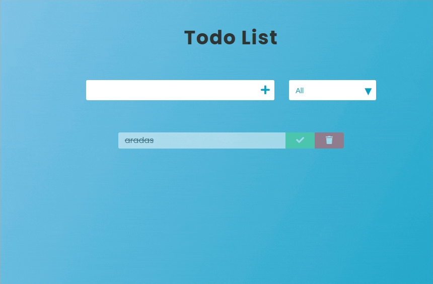
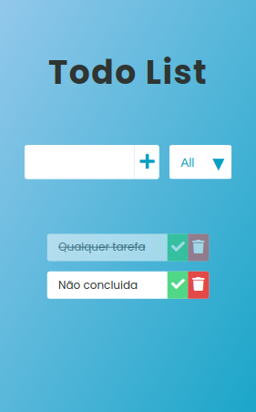

<h1 align="center">
   todoList
</h1>

 

## :camera: Demonstração

## :rocket: Tecnologias

Esse projeto foi desenvolvido com as seguintes tecnologias:

✔️ Javascript

✔️ Vue.js

✔️ Html

✔️ CSS

## 💻 Projeto

todoList é um projeto para por em prática conhecimentos adquiridos sobre `Vue.js`, sobre manipulação de DOM, salvando dados no localStorage, eventos

